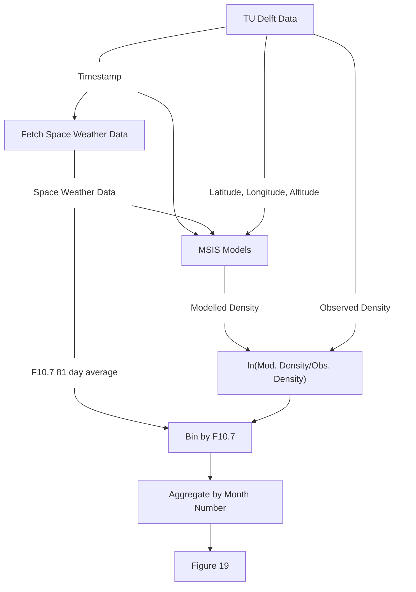
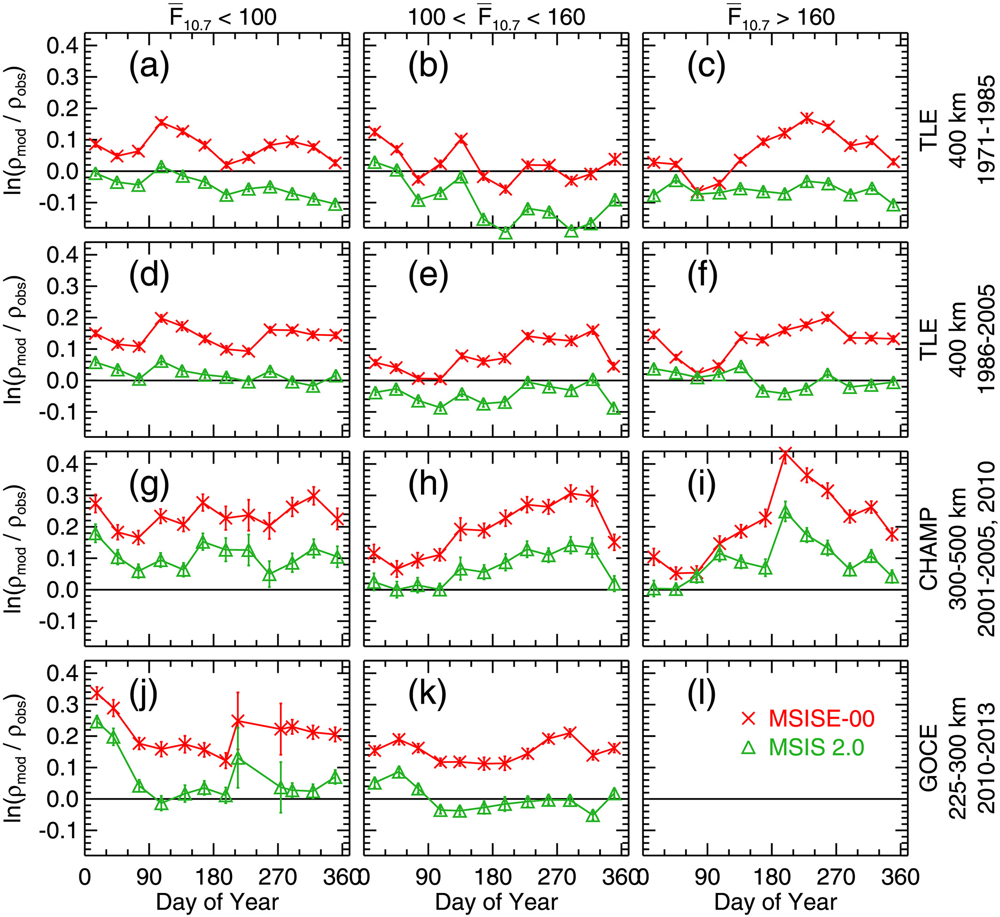

# Thermosphere Model Validation Study

This project investigates the accuracy of NRLMSIS (NRL Mass Spectrometer and Incoherent Scatter Radar) atmospheric models in predicting thermospheric density compared to real satellite observational data. _**This is a work in progress.**_

## Objective

The objective of this project is to study the accuracy of thermospheric models compared to real data observations. CO₂ has a cooling effect on the thermosphere, and since atmospheric CO₂ concentrations have increased significantly over recent decades, there is concern that older models may not accurately predict current thermospheric conditions. This study compares modeled atmospheric densities against observed satellite measurements to identify potential discrepancies and model drift.

## Background

The thermosphere (altitudes ~90-600 km) experiences significant density variations driven by solar activity and geomagnetic storms. Accurate thermospheric density models are critical for:

- Satellite orbit prediction and debris tracking
- Atmospheric drag calculations
- Space weather forecasting

The NRLMSIS family of models (MSISE-00, NRLMSIS 2.0, NRLMSIS 2.1) are widely used empirical models, but they may not fully capture long-term trends related to increasing CO₂, which cools the upper atmosphere and reduces its density.

## Data Sources

### Observational Data (TU Delft Thermosphere Dataset)

Atmospheric density derived from satellite accelerometer measurements, hosted by TU Delft:

| Mission      | Time Period  | Altitude Range |
| ------------ | ------------ | -------------- |
| **CHAMP**    | 2001–2011    | ~300–350 km    |
| **GRACE**    | 2002–2017    | ~450–480 km    |
| **GRACE-FO** | 2018–present | ~490–530 km    |
| **GOCE**     | 2009–2013    | ~250–280 km    |
| **SWARM**    | 2013–present | ~450–530 km    |

**Data URL**: https://thermosphere.tudelft.nl/data/data/version_02/

These missions provide direct thermospheric density measurements through high-precision accelerometers at various altitudes, enabling validation across different solar activity conditions and time periods.

### Model Data

- **NRLMSIS Versions**: MSISE-00, NRLMSIS 2.0, NRLMSIS 2.1 (via [pymsis](https://pypi.org/project/pymsis/))
- **Space Weather Indices**:
  - F10.7 cm solar flux (daily and 81-day centered average)
  - Ap geomagnetic activity index (daily)
  - Source: [NOAA Space Weather Prediction Center](https://www.swpc.noaa.gov/)

## Methodology

The analysis recreates **Figure 19** from Emmert et al. (2020), which shows seasonal variations in model-observation density ratios across different solar activity levels. This figure compares ln(ρ_model/ρ_observed) binned by month and F10.7 solar flux ranges.

The methodology involves:

1. **Data Collection**: Download satellite density measurements and corresponding space weather data
2. **Model Execution**: Run NRLMSIS models at the same timestamps, locations, and altitudes as observations
3. **Comparison Metric**: Compute ln(ρ_model / ρ_observed) — the natural log of the ratio between modeled and observed density
4. **Aggregation**: Bin data by:
   - F10.7 solar activity level (low: <100, medium: 100-160, high: >160)
   - Month of year (to analyze seasonal variations)
5. **Visualization**: Generate comparison plots showing model bias vs. time of year for different solar conditions



## Repository Structure

```
.
├── figure_generator.py      # Generate comparison plots (recreates Emmert et al. 2020 Figure 19)
├── msis_generator.py        # Run NRLMSIS models on satellite data in parallel
├── decode.py                # Decode and process TU Delft data files
├── downloader/
│   ├── tudelft.py           # Download TU Delft satellite data
│   ├── space_weather.py     # Fetch space weather indices (F10.7, Ap)
│   ├── co2.py               # CO₂ concentration data downloader
│   ├── hasdm.py             # HASDM monthly archive downloader
│   ├── common.py            # Shared download utilities
│   ├── manifest.py          # Download tracking and manifest management
│   └── counter.py           # Download statistics counters
└── data/                    # Downloaded and processed data (not in repo)
```

## Usage

### Download Satellite Data

```python
from downloader.tudelft import download_tudelft

# Download all missions
download_tudelft()

# Or download specific missions with date range
download_tudelft(
    missions=["grace", "goce"],
    start_ym=(2010, 1),
    end_ym=(2015, 12)
)
```

### Download HASDM Monthly Archive Data

The HASDM archive endpoint currently redirects through `login.spacenvironment.net`.
Provide an authenticated session to `curl` with one of these environment variables:

- `HASDM_COOKIE`: raw `Cookie` header value
- `HASDM_COOKIE_FILE`: path to a curl-compatible cookie jar

If you capture the request from a browser session, `HASDM_COOKIE` can be set to the
cookie string directly, for example `connect.sid=...`.

The archive is rate-limited to roughly one file per minute, so downloads are run
sequentially with a default 65-second gap between real requests.

This dataset is currently downloaded and decoded for reference, but it is not
used in the main analysis pipeline yet.

```python
from downloader.hasdm import download_hasdm

# Download the full 2000-01 through 2025-12 archive
download_hasdm()

# Or narrow the range while keeping the 65s spacing between requests
download_hasdm(start_ym=(2024, 1), end_ym=(2024, 12), delay_s=65)
```

### Generate MSIS Model Predictions

```python
from msis_generator import compute_msis_density_parallel

# Process files in parallel
compute_msis_density_parallel(
    files=["path/to/satellite_data.parquet"],
    batch_size=100_000,
    processes=4,
    inner_threads=2
)
```

### Create Comparison Figures (Emmert et al. 2020, Figure 19)

```python
from figure_generator import create_figure_19
import polars as pl

# Load processed data
df = pl.read_parquet("data/msis/tudelft/.../file.parquet")

# Recreate Figure 19 from Emmert et al. 2020
# Shows ln(ρ_model/ρ_observed) vs. day of year, binned by F10.7 solar activity
fig = create_figure_19(
    dfs=[df],
    mission_names=["GOCE 2010-2013"],
    msis_00_col="ln_density_ratio_0",
    msis_20_col="ln_density_ratio_2.0",
    msis_21_col="ln_density_ratio_2.1",
    save_path="comparison.png"
)
```

Current Results:


The generated figure reproduces the format of Emmert et al. (2020) Figure 19:

- **Rows**: Different satellite missions/time periods
- **Columns**: F10.7 solar activity levels (<100, 100–160, >160)
- **Y-axis**: ln(ρ_model/ρ_observed) — ln of modeled vs. observed density ratio
- **X-axis**: Day of year (showing seasonal variation)
- **Markers**: pymsis MSISE-00 (red ×), pymsis NRLMSIS 2.0 (green △), pymsis NRLMSIS 2.1 (blue ○), Matlab MSIS-00 implementation (orange □)

Original for Reference [https://agupubs.onlinelibrary.wiley.com/doi/full/10.1029/2020EA001321]:


## Key Findings (Expected)

The analysis investigates whether:

1. MSISE-00 shows systematic biases compared to modern data (post-2000)
2. NRLMSIS 2.0/2.1 improves upon MSISE-00, especially for recent years
3. Model accuracy degrades at higher CO₂ concentrations
4. Seasonal variations are properly captured by the models

A value of ln(ρ_mod/ρ_obs) = 0 indicates perfect agreement. Positive values mean the model overestimates density; negative values mean underestimation.

## Dependencies

We recommend using uv as the package manager.

- Python 3.14+
- `polars`: Data processing
- `pymsis`: NRLMSIS model interface
- `matplotlib`: Visualization
- `numpy`: Numerical operations
- `pyarrow`: Parquet file handling
- `tqdm`: Progress bars

## References

1. Emmert, J. T., et al. (2020). NRLMSIS 2.0: A Whole-Atmosphere Empirical Model of Temperature and Neutral Species Densities. _Earth and Space Science_, 7(4), e2019EA000875.
2. Doornbos, E., et al. (2014). Thermospheric densities derived from spacecraft accelerometry. _Journal of Space Weather and Space Climate_, 4, A32.
3. Bruinsma, S., et al. (2018). The Swarm total electron density and thermosphere empirical model (DEE+T) and applications. _Advances in Space Research_, 62(5), 1152-1160.

## License

This project is licensed under the **MIT License** — see [LICENSE.txt](LICENSE.txt) for details.

Note: While the code is MIT-licensed, the satellite data from TU Delft is subject to their respective data usage policies. Space Weather data is provided by [Celestrack](https://celestrak.org/spacedata/)
